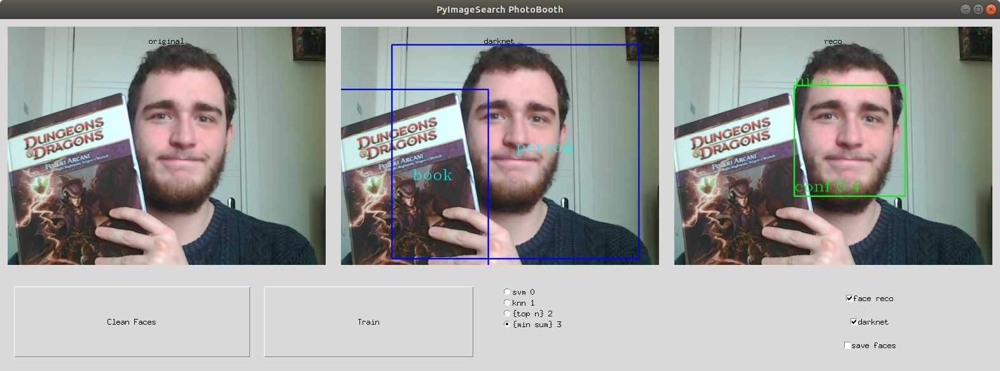

# MotionBot

This branch brings the concept of smart surveillance system beyond its
original scope. The famous [Darknet](https://pjreddie.com/darknet/)
framework has been successfully integrated, making the object
recognition task fast and secure.
 
More over the face recognition task has been improved using the
[face recognition repo](https://github.com/ageitgey/face_recognition).

## Installation
In this section the setup for this branch is explained.
 
You **must** perform the setup of the master branch first in order to
make this one work.

Remember to use:
 
 `git submodule update --init --recursive`
 
 after cloning the repo to download the darknet submodule.


### Raspberry
Follow [this](https://gist.github.com/ageitgey/1ac8dbe8572f3f533df6269dab35df65) instructions to download
the face recognition module on raspberry pie.


### Python 
Install the requirements using
 
`pip install -r requirements.txt`
  
So that the additional packages will be installed. 

Run the [Path](./src/Path.py) file to initialize missing files:
 
`python ./src/Path.py`

If you are having problem with the imports configure the *PYTHONPATH* using:

`PYTHONPATH=. python src/main.py`

In the main directory

### Telegram 
Fill the [token_psw file](./Resources/token_psw.txt) with your token on the first line and your password on the 
second line, for example:
```
numbers:some_random_string-other_string
1234567
```

### Darknet Setup
For the darknet installation refer to the following links:
- Follow the instructions in the [darknet](https://pjreddie.com/darknet/install/) to compile the darknet environment
- Run [setup.sh](./setup.sh) in the main directory to perform the setup


## Usage

There are various python files which can be executed.

### Main 

To start the secure system first position your camera where you want and
then use the [main.py](./src/main.py) file:
 
 `python ./src/main.py`


If everything worked fine you should see the following messages:
```
TOKEN : your token
Password : 12345678
getting ids from file
...
Darknet metadata loading
...
camera connected
Polling...
Reset ground image ...
Done
```
If not look at the [Journal](./Journals/Journal_Darknet.md) to check for possible solutions to your problem.

### Tests
There are multiple kind of test executables in the [Test](./src/Tests) directory.

#### Darknet 

[This file](./src/Tests/darknet_test.py) works uniquely with the darknet framework showing how it works in
real time. You can also take screenshots of what the program is seeing (notice that a webcam must be
connected in order to make it work), as shown in the following image.


#### File recognizer
[This file](./Readme/images/file_recognizer_test.py) is used to test the
recognizer with static images. It supports the loading of a custom image
from the device and the choosing of multiple types of algorithm for face
recognition (see the
[Classification algorithms section](Readme/face_recognizer.md) for more
information on the algorithms).


#### Video recognizer
[This file](./src/Tests/video_recognizer_test.py) does the same as the
previous two but on videos. It allows to segment the video feed from the
webcam with both the face recognizer and darknet. Notice that the
activation of both will slow down the cam FPS.
 Moreover there are some additional
functionality:
- The *save faces* checkbox is used to save detected faces in the [Unkown](./Faces/Unknown) directory in order to gain 
samples faster than using the surveillance system.
- The *clean face* button is used to filter those images in the [Unkown](./Faces/Unknown) directory which have a similarity higher than a 
certain threshold
- The *Train* button trains the model on new images in the [Faces](./Faces) directory. 


## More to know
For additional information refer to the markdowns in the
[Readme dir](Readme/). 

Specifically to: 
- [this file](Readme/face_recognizer.md) for behavior
of the [Face recognizer class](src/Classes/Face_recognizer.py)
- [this one](Readme/darknet.md) for the functionality of the
  [Darknet class](src/Classes/Darknet.py)
- [this file](Readme/flags.md) for more insights on the
  [Flags class](src/Classes/Flags.py)